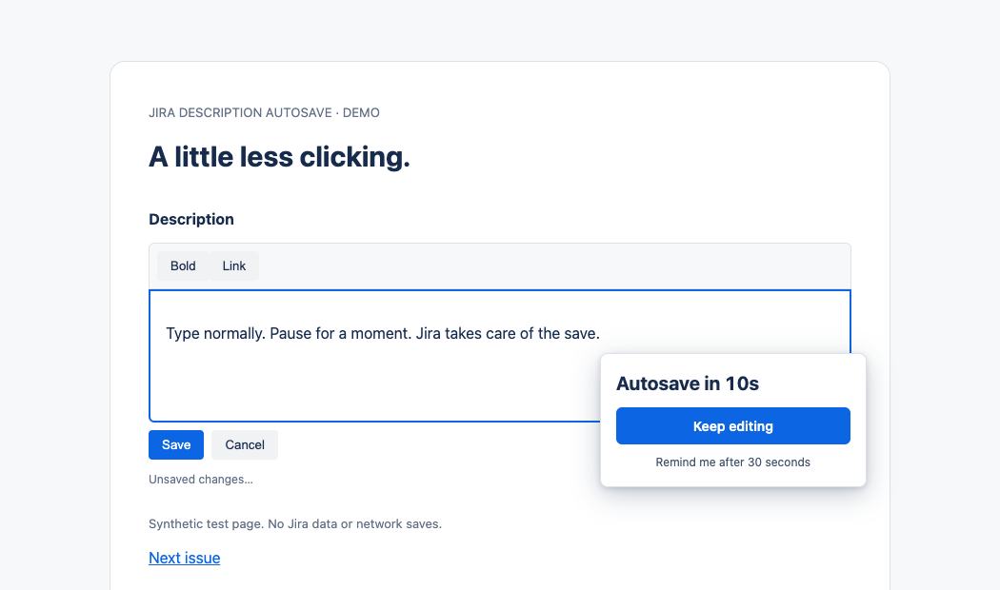

<p align="center"></p>
<h1 align="center">Jira Description Autosave</h1>
<p align="center">Type. Pause. Let Jira save.</p>
<p align="center"><a href="https://github.com/lukezharris/jira-autosave/actions/workflows/ci.yml"></a>  <a href="LICENSE"></a></p>

A small Chrome and Edge extension that clicks **Jira's own Description Save button** after a 10-second pause and a cancellable 10-second countdown. No API keys, setup screens, subscriptions, or backend.

**Preview release.** The original v0.1.0 had live Chrome and Edge checks; the new countdown needs a fresh live Jira check. Jira's editor DOM can change. The extension deliberately does nothing when it cannot confidently identify the Description controls. See [validation and limitations](docs/TESTING.md) before relying on it for important edits.



*Illustrative test page, not a screenshot of Jira or customer data.*

## Install from GitHub

**You do not need the Chrome Web Store to try it.** Download once, unzip, and load the folder in your browser. No Node.js or build step is needed.

1. Download the latest **`jira-description-autosave-<version>.zip`** from [Releases](https://github.com/lukezharris/jira-autosave/releases).
2. Extract it into a permanent folder. Keep that folder while using the extension.
3. Open `chrome://extensions` in Chrome, or `edge://extensions` in Edge.
4. Turn on **Developer mode**, choose **Load unpacked**, and select the extracted folder containing `manifest.json`.
5. Refresh any Jira tabs that were already open.
6. Open a disposable issue, edit its **Description**, and pause. Confirm the save, then reload the issue to check the result.

Alternatively, clone this repository or use GitHub's **Code → Download ZIP**, extract it, and load the repository folder itself.

Install it in the browser **profile you use for Jira**. Work and personal profiles have separate extensions. Managed browsers may restrict developer-mode installation; follow your organisation's policy.

Official instructions: [Chrome](https://developer.chrome.com/docs/extensions/get-started/tutorial/hello-world#load-unpacked) · [Edge](https://learn.microsoft.com/en-us/microsoft-edge/extensions/getting-started/extension-sideloading).

### Updating or removing it

GitHub installations **do not update automatically**. Extract a newer release over the same extension folder, click **Reload** on the extension's card, and refresh Jira. Git users can pull the new version instead of extracting a ZIP.

To pause autosave, switch the extension off on the browser's Extensions page and refresh Jira. To uninstall, choose **Remove** and refresh Jira. No settings or stored drafts need cleaning up.

### What about the Chrome Web Store?

GitHub is enough for early testers comfortable with Developer mode. A reviewed Chrome Web Store listing is the next step for convenient installation and automatic updates; an unlisted listing can also be shared by link. A ZIP on GitHub is an unpacked installation, not a one-click store installation. There is no store listing yet.

The release ZIP is also suitable as the starting upload package for a store submission. See [distribution notes](docs/DISTRIBUTION.md) for the remaining listing work.

## Everyday use

Edit an existing issue's **Description** as usual. After **10 seconds without keystrokes**, a floating Jira-themed notice near the text caret says **Autosave in 10s** and counts down. At zero, the notice disappears and Jira saves, which may close the editor. Typing again dismisses the countdown and restarts the idle timer. The notice never takes keyboard focus. It stays inside the visible window, moves above the caret when needed, and moves to the centre of the visible window if the caret is offscreen. It remains visible over scrolling containers.

Choose **Keep editing** on the countdown to postpone saving. For the rest of that editing session, each countdown starts after **30 seconds of inactivity**, then gives you another 10 seconds to cancel. Opening a new editor restores the default 10-second idle delay.

A small status appears below the field:

| Status | Meaning |
| --- | --- |
| Unsaved changes… | An edit was detected; waiting for you to pause. |
| Saving… | Jira's Save action has been triggered. |
| Saved | Jira left Description edit mode in the same field and page. Shown briefly. |
| Save failed | An error, timeout, unavailable control, or ambiguous completion prevented confirmation. Check Jira's own message and save manually if needed. |

- **Jira’s own Cancel still discards the edit.** The countdown’s **Keep editing** button only postpones autosave. Pending autosave stops when you use Jira's Cancel control. It cannot undo an autosave that has already completed.
- Manual **Save** and **Ctrl/Cmd+Enter** keep working.
- Clicking or focusing outside the editor still attempts an immediate save, without a countdown. Interacting with the countdown itself never triggers that departure save. Recognised formatting menus, dialogs, and composition input postpone autosave.
- Direct issue URLs and board URLs with `selectedIssue` use the same field detection. Newly mounted editors are detected during Jira navigation.
- Each browser tab works independently.

Navigation saves are best effort: a page close, reload, or fast issue switch may tear down Jira before it finishes saving. This extension does not block navigation or provide a draft backup. Check that Jira has finished saving before leaving important edits.

## Privacy and permissions

Everything the extension does runs locally in the tab. It observes events and DOM structure, reads button labels and caret geometry, and clicks the native Save button. **It never reads, serializes, rewrites, or stores Description content.** Jira remains responsible for its normal save requests, formatting, validation, permissions, and errors.

- No extension network requests, telemetry, analytics, or remote code.
- No account, API token, storage, tabs, or webRequest permission.
- Static content scripts match only `https://*.atlassian.net/*`.
- No access to unrelated websites and no backend.

The browser's site-access warning reflects the content script's ability to interact with Atlassian pages. See the [privacy policy](PRIVACY.md) and inspect the small [runtime](content.js).

## Scope and limitations

Jira Cloud issue Description only. Chrome and Edge are the target browsers. Firefox, Jira Server/Data Center, comments, create-issue forms, other rich-text fields, and non-`atlassian.net` domains are out of scope.

The initial control matching uses English **Save** and **Cancel** labels. Other Jira interface languages are not yet supported. When multiple controls or editors are ambiguous, native Jira behaviour is left in place.

There is no conflict detection, cross-tab coordination, version history, or recovery layer. If you edit during an in-flight save and Jira closes the editor before those changes can be confirmed, the extension reports failure rather than claiming everything was saved. It never reconstructs your text.

## Development

The extension itself has **no runtime dependencies and no build step**. Node.js 22+ is only needed for tests; Python 3 is used to package releases and regenerate icons.

```sh
npm ci
npm run check
npm test
npx playwright install chromium
npm run test:browser
npm run package
```

The browser suite loads the real extension in an isolated Chromium profile against synthetic pages. Set `JDA_BROWSER_CHANNEL=msedge` to run it against an installed Microsoft Edge instead (see [validation details](docs/TESTING.md#microsoft-edge-follow-up)). It does not log into Jira. The package script uses an explicit file allowlist and emits a reproducible ZIP plus SHA-256 checksum under `dist/`.

| File | Purpose |
| --- | --- |
| `manifest.json` | Manifest V3 and the Atlassian-only site match |
| `content.js` | Centralised Jira selectors, editor lifecycle, idle timer, countdown and status |
| `content.css` | Status and cancellable countdown with Jira theme support |
| `tests/` | State/event regression tests and real-extension browser fixtures |
| `scripts/` | Manifest checks, icon generation and release packaging |
| `spec.md` | Implementation brief and updated timing behaviour |

Selectors live near the top of `content.js`; timing defaults are in `CONFIG`. The safety rule is simple: **if the Description Save button is uncertain, do nothing.** See [test coverage and live checks](docs/TESTING.md) before changing selectors.

## Report a problem

[Report a reproducible bug](https://github.com/lukezharris/jira-autosave/issues/new/choose) using the issue form. Please remove issue content, customer information, tokens, and private URLs from screenshots or DOM snippets.

This is a maintainer-developed project shared for others to use. **External pull requests are not accepted; pull requests are disabled.** First-hand bug reports are welcome. Unverified AI-generated reports, bulk audits, promotional posts, and unsolicited contribution requests may be closed without discussion. See the [contribution and reporting policy](CONTRIBUTING.md).

MIT licensed. Independent project; not affiliated with or endorsed by Atlassian, Google, or Microsoft.
